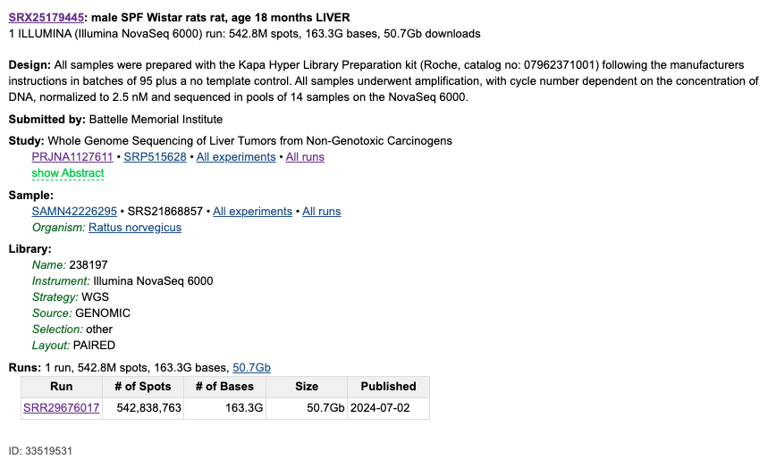
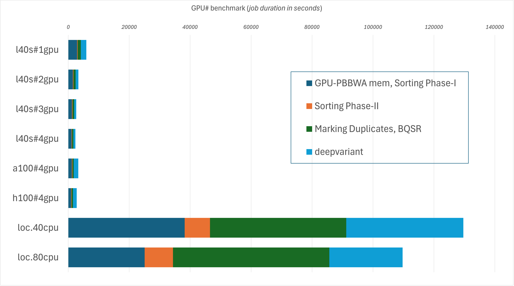

[(Nucleomics-VIB)](https://github.com/Nucleomics-VIB)

ReadMe
==========

## Data Availability 

The reads used in this analysis were obtained from NCBI [SRA](https://www.ncbi.nlm.nih.gov/sra/?term=SRR29676017) from the dataset: 
These paired end 2x150 reads were obtained with Novaseq on a rat sample "SRX25179445: male SPF Wistar rats rat, age 18 months LIVER"

SRR29676017: 135'709'684 read pairs - 59x



## Method

Read data was used without pre-processing as the aim of this analysis is to compare runtimes between methods and the presence of adaptors in NGS reads was shown not to be a significant issue thanks to soft clipping occuring during read mapping.

## Usage

Several scripts were written to perform a full variant calling workflow either using the local CPU on two **[VIB Nucleomics Core](https://nucleomicscore.sites.vib.be/en)** servers OR using the NVidia GPU cards present in several **[VIB Data Core](https://datacore.sites.vib.be/en)** nodes.
The scripts are included in this repo and can be tuned to further improve them (adapting for instance the existing nextflow workflow instead of bash scripts)

The GPU code was adapted from the published **[NVidia Clara Parabricks code documentation](https://www.nvidia.com/en-us/clara/genomics/)**.
The Nvidia l40s was out target card but the presence of two more expensive cards (h100 and a100) led us to also test these as well.

The produced scripts are the following:

* slurm_deepvariant_germline_a100.sh

* slurm_deepvariant_germline_h100.sh

* slurm_deepvariant_germline_l40.sh

The CPU code was refactored from existing scripts and performs basically the same steps as the Parabricks pipeline although not all steps run on multiple cores (while the Parabricks steps do make extensive use of the multiple GPU resurces).
This explains in part the large discrepancy in the final metrics.

The produced script is:

* local_deepvariant_germline_cpu.sh

## Results obtained with the demo data

Several runs on the Data Core infrastructure (first interactive runs then, when this was optimized, queued jobs)

The SLURM parameters used in the job submission were as follows (sensitive data replaced by ***):

```
l40s
#SBATCH --job-name="parabricks_deepvariant_germline"
#SBATCH --output="%x_%j.out"
#SBATCH --error="%x_%j.err"
#SBATCH --nodes=1
#SBATCH --ntasks=32
#SBATCH --cpus-per-task=4
#SBATCH --time=0-08:00:00
#SBATCH --mem=512G
#SBATCH --account=***
#SBATCH --gres=gpu:4
#SBATCH --partition=gpu_l40s_64C_128T_1TB
a100
#SBATCH --job-name="parabricks_deepvariant_germline"
#SBATCH --output="%x_%j.out"
#SBATCH --error="%x_%j.err"
#SBATCH --nodes=1
#SBATCH --ntasks=16
#SBATCH --cpus-per-task=4
#SBATCH --time=0-02:00:00
#SBATCH --mem=256G
#SBATCH --account=***
#SBATCH --gres=gpu:4
#SBATCH --partition=gpu_a100_48C_96T_512GB
h100
#SBATCH --job-name="parabricks_deepvariant_germline"
#SBATCH --output="%x_%j.out"
#SBATCH --error="%x_%j.err"
#SBATCH --nodes=1
#SBATCH --ntasks=16
#SBATCH --cpus-per-task=4
#SBATCH --time=0-02:00:00
#SBATCH --mem=256G
#SBATCH --account=***
#SBATCH --gres=gpu:4
#SBATCH --partition=gpu_h100_64C_128T_2TB_co_pi
```

For the l40s, four jobs were run allocating all 4 cards but using 1..4 of the present GPU units as detailed in the table below. 

For other GPU, all 4 cards were allocated and used.

Time results extracted from the log files for the GPU Jobs

* gpu_l40s_64C_128T_1TB
* gpu_a100_48C_96T_512GB
* gpu_h100_64C_128T_2TB_co_pi

```
|                                        | l40s      | l40s      | l40s      | l40s      | a100      | h100      | Chicken   | r730      |
|----------------------------------------|-----------|-----------|-----------|-----------|-----------|-----------|-----------|-----------|
| jobID (datacore)                       | 20188     | 20189     | 20190     | 20266     | 20273     | 20276     | #NA       | #NA       |
| nGPU (Nvidia L40s)                     | 1         | 2         | 3         | 4         | 4         | 4         | 0         | 0         |
| label                                  | l40s#1gpu | l40s#2gpu | l40s#3gpu | l40s#4gpu | a100#4gpu | h100#4gpu | loc.40cpu | loc.80cpu |
| GPU-PBBWA mem, Sorting Phase-I         | 2900      | 1510      | 1200      | 1070      | 1170      | 920       | 38195     | 25072     |
| Sorting Phase-II                       | 170       | 170       | 175       | 175       | 175       | 175       | 8309      | 9288      |
| Marking Duplicates, BQSR               | 1034      | 705       | 562       | 415       | 435       | 431       | 44711     | 51300     |
| deepvariant                            | 1825      | 929       | 678       | 690       | 1495      | 1247      | 38427     | 24054     |
| total (sec)                            | 5929      | 3314      | 2615      | 2350      | 3275      | 2773      | 129642    | 109714    |
| times slower than using 4 x   l40s GPU | 2.5       | 1.4       | 1.1       | 1.0       | 1.4       | 1.2       | 55.2      | 46.7      |
```

Time results for the CPU runs

* Chicken 256GB RAM, 48 threads (40 used; Intel(R) Xeon(R) CPU E5-2680 v3 @ 2.50GHz)
* Dell R730 512GB RAM, 88 threads (80 used; Intel(R) Xeon(R) CPU E5-2699 v4 @ 2.20GHz)

```
|                    | 40cpu  | 80cpu  |
|--------------------|--------|--------|
| BWA mem + sort     | 38195  | 25072  |
| Marking Duplicates | 9926   | 11243  |
| Sorting Phase-II   | 8309   | 9288   |
| BQSR               | 18469  | 21315  |
| applyBQSR          | 16316  | 18742  |
| deepvariant        | 38427  | 24054  |
| total              | 129642 | 109714 |
```

Each command was timed and the total computing duration used to produce a summary plot shown below.




## Conclusion

The use of even one GPU card is very beneficial to save a considerable amount of time in variant analysis which is a very time consuming task.
Using more GPU units further decreased the runtime but not to a significant extend, suggesting a bottleneck at the IO level.

The availability of such GPU cards at the VIB Data Core makes it amendable to future projects if the availability and cost associated with the use of the Data Core infrastructures are compatible with our model.

<hr>

<h4>Please send comments and feedback to <a href="mailto:nucleomics.bioinformatics@vib.be">nucleomics.bioinformatics@vib.be</a></h4>

<hr>


This work is licensed under a [Creative Commons Attribution-ShareAlike 3.0 Unported License](http://creativecommons.org/licenses/by-sa/3.0/).
