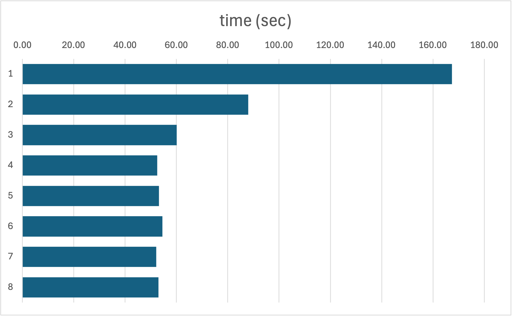
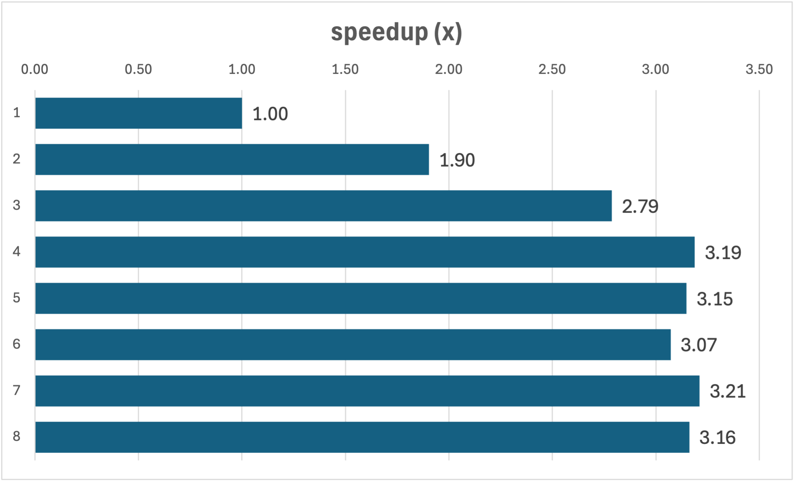

[(Nucleomics-VIB)](https://github.com/Nucleomics-VIB)

Benchmark for fastq (v1.24) on paired Aviti reads
==========

## Data Availability 

Two paired nucleomics Core Aviti read files were used from a current project to evaluate the process.

4920_01_A1_20487881F4509f06A1_S5_L001_R1_001.fastq.gz (27'454'743 150b reads)
4920_01_A1_20487881F4509f06A1_S5_L001_R2_001.fastq.gz (27'454'743 150b reads)

## Method

Run fastp in increasing number of threads (1..8) and time the process. Define the optimal speedup and associated cpu costs.

## Results

The commands were run on 1OM reads (see script).

| threads | time (sec) | speedup (x) |
|---------|------------|-------------|
| 1       | 167.43     | 1.00        |
| 2       | 87.97      | 1.90        |
| 3       | 60.07      | 2.79        |
| 4       | 52.53      | 3.19        |
| 5       | 53.19      | 3.15        |
| 6       | 54.52      | 3.07        |
| 7       | 52.15      | 3.21        |
| 8       | 52.95      | 3.16        |

## Conclusion

nthr=4 is optimal (3.19x faster) under the experimental setup and computing resources

<h4>Please send comments and feedback to <a href="mailto:nucleomics.bioinformatics@vib.be">nucleomics.bioinformatics@vib.be</a></h4>

This work is licensed under a [Creative Commons Attribution-ShareAlike 3.0 Unported License](http://creativecommons.org/licenses/by-sa/3.0/).
