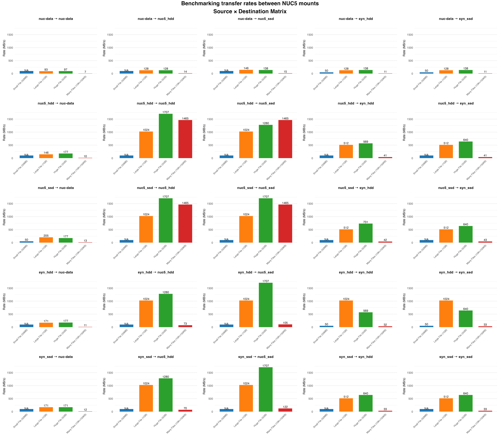

# NUC5 Storage Speed Test Benchmark

Comprehensive storage performance benchmarking tool for testing read/write speeds across multiple mount points on **Nuc5**.

## Overview

This benchmark suite tests file transfer performance between different storage systems (HDD, SSD, network shares) using various file sizes and patterns. The tool measures actual file copy operations and reports transfer rates in MB/s.



**Note about NA values:** NA (Not Available) appears when file transfers complete in less than 1 second. The timing granularity is insufficient to compute an accurate transfer rate. This typically occurs with small files (50MB) on fast storage, cached transfers, or same-source-destination copies on fast media. NA values are displayed in plots and excluded from statistical calculations.

## Components

- **`storage_speed_test.sh`** - Main bash script that runs the benchmark tests
- **`plot_storage_results.R`** - R script to generate comprehensive visualizations (5 plot types)
- **`plot_storage_matrix.R`** - R script to generate matrix layout plots (Source × Destination grid)
- **`test_data/`** - Local directory containing reusable test files (auto-generated once)
- **`pictures/`** - Directory containing generated plots

## Requirements

### For running tests
- `bash`
- `dd` (data duplicator for file generation)
- Write access to mount points

### For plotting
- R (≥ 4.0)
- R packages: `ggplot2`, `dplyr`, `tidyr`, `viridis`, `scales`, `gridExtra`, `grid`

## Installation

```bash
# Install required R packages
R -e 'install.packages(c("ggplot2", "dplyr", "tidyr", "viridis", "scales", "gridExtra", "grid"))'
```

## Usage

### 1. Configure Mount Points

Edit `storage_speed_test.sh` and modify the `MOUNTS` array to include your storage locations:

```bash
MOUNTS=(
    "/mnt/hdd_storage"
    "/mnt/ssd_storage"
    "/mnt/syn_hdd"
    "/mnt/syn_ssd"
)
```

### 2. Run Benchmark

```bash
chmod +x storage_speed_test.sh
./storage_speed_test.sh
```

The script will:
- Check mount point accessibility
- Generate test files (1MB, 100MB, 1GB, and 100 small files)
- Test all source → destination combinations
- Generate results in both text and CSV format
- Clean up temporary files

### 3. Generate Plots

After the benchmark completes, create visualizations:

```bash
Rscript plot_storage_results.R speed_test_results_YYYYMMDD_HHMMSS.csv
```

Replace the filename with the actual CSV file generated by the test.

### 3. Generate Visualizations

#### Comprehensive Plots (5 types)

```bash
Rscript plot_storage_results.R speed_test_results_YYYYMMDD_HHMMSS.csv
```

Generates in `pictures/`:

- `storage_heatmap.png` - Heatmap showing transfer rates between all storage pairs
- `storage_testtype_comparison.png` - Average rates by test type with error bars
- `storage_pairs_comparison.png` - Ranked comparison of all storage pairs
- `storage_distribution.png` - Box plots showing rate distributions
- `storage_trends.png` - Line plots showing performance trends

#### Matrix Layout Plot

```bash
Rscript plot_storage_matrix.R speed_test_results_YYYYMMDD_HHMMSS.csv
```

Generates in `pictures/`:

- `storage_matrix.png` - Grid layout with one subplot per Source × Destination pair
- `storage_<source>_to_<dest>.png` - Individual detailed plots for each pair

## Test Specifications

### Test Types

1. **Small File (50MB)** - Tests small file transfer performance
2. **Large File (1GB)** - Tests medium-large file transfers
3. **Huge File (5GB)** - Tests bulk data transfer capabilities
4. **Many Small Files (10,000 × 150KB)** - Tests metadata-intensive operations

### Configuration

Modify test sizes in `storage_speed_test.sh`:

```bash
SMALL_FILE_SIZE="50M"     # Single small file
LARGE_FILE_SIZE="1G"      # Single large file
HUGE_FILE_SIZE="5G"       # Single huge file
MANY_FILES_SIZE="150K"    # Size of each small file
NUM_SMALL_FILES=10000     # Number of small files
```

### Mount Name Mapping

The script generates short names from mount paths:

- `/mnt/hdd_storage` → `nuc5_hdd`
- `/mnt/ssd_storage` → `nuc5_ssd`
- `/mnt/syn_hdd` → `syn_hdd`
- `/mnt/syn_ssd` → `syn_ssd`

## Metrics

### Transfer Rate (MB/s)

Transfer rate is calculated as: **Rate = Size_bytes / (Time_s × 1024 × 1024)**

Typical performance ranges:

- Local SSD → SSD: 200-500 MB/s
- Local HDD → HDD: 80-150 MB/s
- Network shares: 10-120 MB/s

## Output Files

### Text Report

`speed_test_results_YYYYMMDD_HHMMSS.txt` - Summary report with:

- Test configuration
- Complete results table
- Performance analysis (fastest/slowest operations)

### CSV Data

`speed_test_results_YYYYMMDD_HHMMSS.csv` with columns:

- `Source` - Source storage mount name
- `Destination` - Destination storage mount name
- `TestType` - Test type identifier
- `Time_s` - Transfer time in seconds
- `Rate_MBps` - Transfer rate in MB/s (or "N/A")
- `Size_bytes` - Total data transferred in bytes

### Log File

`speed_test_YYYYMMDD_HHMMSS.log` - Complete execution log

## Key Features

- **Real-time CSV writing** - Results written immediately after each test
- **Test data reuse** - Files generated once in `test_data/` and reused
- **Automatic cleanup** - Temporary files removed automatically
- **NA value handling** - Plots properly display missing values
- **Dual visualization** - Two complementary plotting approaches

## License

See main repository LICENSE file.
